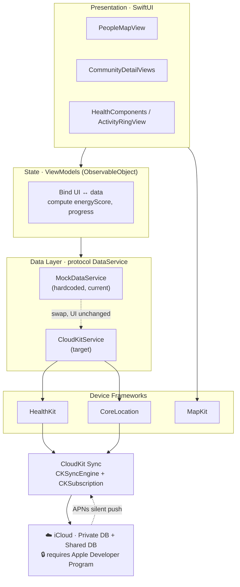
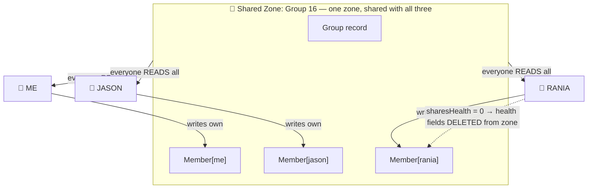
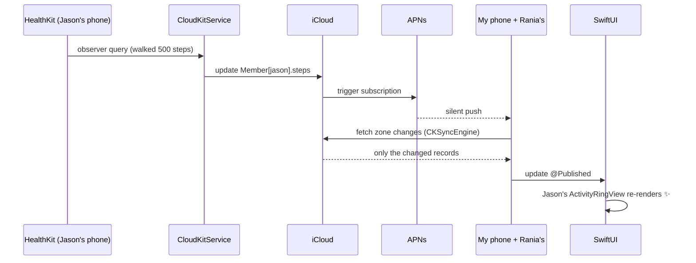

# SKIBIDI — CloudKit Architecture

Find My + Health/Fitness with group-based sharing: multi-user, real-time, with a per-member sharing toggle.

---

## A. Layered Stack



The key seam is `protocol DataService`. Because the UI only talks to that protocol, swapping `MockDataService` for `CloudKitService` requires no changes to any View.

---

## B. Sharing Topology (Privacy Model)



Each person **writes** only their own `Member` record but **reads** all of them. Turning a toggle off deletes the data from the cloud entirely — it is not merely hidden in the UI. That makes the privacy story real and demoable.

---

## C. Real-Time Data Flow (single update)



---

## Schema Summary

**Group** (from `Community`): `name`, `type`, `dateActive`, `coverImage: Asset?`, `defaultLocationSharing / defaultHealthSharing / defaultFitnessSharing: Int64`

**Member** (from `User` + `HealthSnapshot`): `userRecordName`, `displayName`, `emoji`, `ringColor`, `status`, `sharesLocation / sharesHealth / sharesFitness: Int64`, `location: CLLocation?`, `locationUpdatedAt`, plus the health fields (`steps`, `stepsDistanceKm`, `sleepHours`, `restingHeartRate`, `hydrationPercent`, `moveCalories`, `moveGoal`, `exerciseMinutes`, `exerciseGoal`, `standHours`, `standGoal`, `activeCalories`, `healthUpdatedAt`).

> `energyScore`, `moveProgress`, and `memberCount` are computed on the client — do **not** store them.
> `AppNotification` is generated on the client from sync events — no record type needed.

---

## CloudKit Primer

**Five core objects:**
- `CKContainer` — your app's iCloud container (`CKContainer.default()`).
- `CKDatabase` — `.privateCloudDatabase` / `.sharedCloudDatabase` / `.publicCloudDatabase`.
- `CKRecord` — one row of data. Dictionary-like: `record["steps"] = 31143`. Has a `recordType` and a `recordID`.
- `CKRecordZone` — a "folder". A custom zone is required for sharing and change tracking.
- `CKShare` — the object that makes a zone/record shareable with other iCloud users.

**Hello world — write & read (private DB; experiment here before touching sharing):**
```swift
import CloudKit

let db = CKContainer.default().privateCloudDatabase

// WRITE
let rec = CKRecord(recordType: "Member")
rec["displayName"] = "Your Name"
rec["steps"] = 31143
let saved = try await db.save(rec)

// READ
let fetched = try await db.record(for: saved.recordID)
print(fetched["displayName"] as? String ?? "")
```

**Three beginner gotchas:**
1. **Fields are auto-typed on first write.** CloudKit infers a field's type the first time you save a value to it; a wrong type sticks. Prefer defining the schema in the CloudKit Dashboard first.
2. **The default zone can't be shared and has no change tracking.** For sharing/sync you must create a custom `CKRecordZone`.
3. **Development and Production schemas are separate.** Once stable, "Deploy to Production" in the Dashboard, or your released build will error.

**Further learning:**
- Apple docs: *CloudKit*, *Sharing CloudKit Data with Other iCloud Users*.
- WWDC: "Get the most out of CloudKit Sharing", "Sync to iCloud with CKSyncEngine" (2023).
